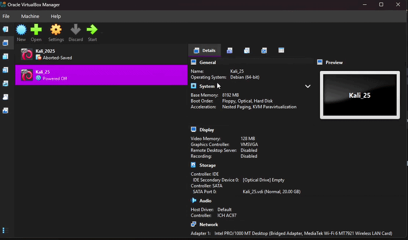

# Enterprise Active Directory Home Lab 

## Objective 
[Brief Objective - Remove this afterwards]  

The Detection Lab project aimed to establish a controlled environment for simulating and detecting cyber attacks. The primary focus was to ingest and analyze logs within a Security Information and Event Management (SIEM) system, generating test telemetry to mimic real-world attack scenarios. This hands-on experience was designed to deepen understanding of network security, attack patterns, and defensive strategies.

### Skills Learned
[Bullet Points - Remove this afterwards]

- Advanced understanding of SIEM concepts and practical application.
- Proficiency in analyzing and interpreting network logs.
- Ability to generate and recognize attack signatures and patterns.
- Enhanced knowledge of network protocols and security vulnerabilities.
- Development of critical thinking and problem-solving skills in cybersecurity.

### Tools Used
[Bullet Points - Remove this afterwards]

- Security Information and Event Management (SIEM) system for log ingestion and analysis.
- Network analysis tools (such as Wireshark) for capturing and examining network traffic.
- Telemetry generation tools to create realistic network traffic and attack scenarios.

## Steps

1.Download Oracle VirtualBox and the extension pack (https://www.virtualbox.org/wiki/Downloads)  

1.2Download Windows Server 2019 (https://www.microsoft.com/en-us/evalcenter/download-windows-server-2019)

1.3Download Windows 10 (https://www.microsoft.com/en-us/software-download/windows10)    

 
 
Select the disk:   

 
 
Enter the number of passes:  

 
 
Confirm your selection:   

 
 
Wait for process to complete (may take some time):   

 
 
Sanitization complete:   

 
 
Observe the wiped disk:   

